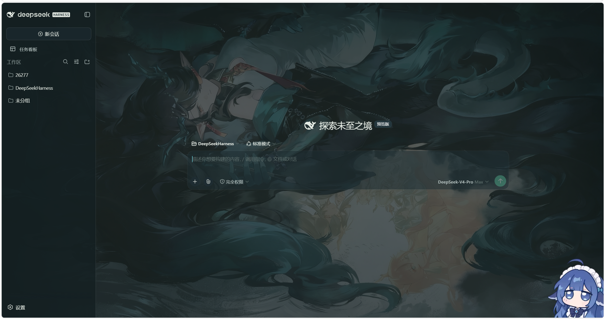

# dsh-dusk-theme · 夕

> DeepSeek Harness Web 主题皮肤：主题配色 + 朱砂「夕」印章，**自带作者同款默认背景图与默认设置**（开箱即与作者 UI 一致），支持本地背景图取景、双透明度滑杆与自定义背景底色。

## 特性

- **主题配色**：以石青（azurite）、石绿（malachite）、黛青为基调，纯白（日间）/ 黛青夜墨（夜间）双模式，覆盖 `--dsw-*` 全量语义 token，随 DSH 明/暗主题自动切换。
- **自带默认背景**：仓库打包作者的默认背景图（`assets/default-background.jpg`，构建时注入客户端 bundle）；新用户不设置任何东西，打开即是作者的取景（x=65.7% / y=64.2% / 1×）与透明度（主屏 41% / 其他界面 74%）。
- **朱砂「夕」印章**：右下角一枚朱砂印章作为签名元素，带微光动效。
- **本地图背景入口（在设置内）**：在「设置 → 通用」的「背景图片」行选择本地图片，取景弹窗支持**拖动选区域 + 滚轮/滑杆缩放**，确定后铺为背景（存于浏览器 localStorage，不打包进仓库）；另有**主屏 / 其他界面两条透明度滑杆**与一键清除。
- **背景底色可自定义**：行内「背景底色」支持取色器与 `#rrggbb` / `rgb(r,g,b)` 直接输入（自动派生表面层级）；留空或「恢复默认」则跟随 DSH 浅色/深色/跟随系统。
- **图层安全**：背景层位于 `z-index:-1`，永远沉在界面内容之下，图片不会遮挡文字。
- **尊重系统偏好**：动效遵守 `prefers-reduced-motion`。

## 效果预览



## 安装

已安装 [DeepSeek Harness](https://github.com/deepseek-ai/deepseek-harness) 后，任选其一：

### 从 GitHub 安装（推荐）

```bash
dsh plugin --profile web add github:Skylin1129/dsh-dusk-theme
```

> `<owner>` 替换为你的 GitHub 用户名/组织名。仓库需已包含构建产物 `lib/`（本仓库默认提交）。

### 从 npm 安装

```bash
dsh plugin --profile web add dsh-dusk-theme
```

### 从本地源码安装

```bash
git clone https://github.com/Skylin1129/dsh-dusk-theme
dsh plugin --profile web add ./dsh-dusk-theme
```

安装后重启/刷新 DSH Web 即可生效。

## 使用

- 首次使用即应用内置默认背景（作者同款）；「设置 → 通用 → 背景图片」→「选择图片」→ 在取景弹窗里**拖动选择图片区域、滚轮/滑杆缩放** →「确定」替换为自己的背景。
- 行内可「**调整区域**」（重新取景）、「**更换图片**」、「**清除**」（清除后为无背景的纯净配色，不会回到内置默认图）。
- 两条透明度滑杆（设背景后出现）：**界面透明度**控制主屏（对话区 / 输入区 / 气泡，10–96%，默认 41%）；**其他界面透明度**控制侧栏、面板、弹窗、菜单等（10–100%，默认 74%）。
- 「**背景底色**」：取色器或直接输入 `#rrggbb` / `rgb(r,g,b)` 自定义默认背景色（自动派生明暗表面层级）；「恢复默认」或留空则跟随 DSH 浅色/深色/跟随系统。
- 明/暗外观跟随 DSH「设置 → 通用 → 外观」的浅色/深色/跟随系统。

## 卸载

```bash
dsh plugin --profile web rm dsh-dusk-theme
```

## 开发

```bash
node scripts/build.mjs   # 零依赖构建，产出 lib/index.js 与 lib/client.js
```

`src/client/index.js` 为客户端源码（配色 token 覆盖、背景层与印章、取景弹窗、双透明度滑杆、背景底色），构建脚本把它包装成 DSH 客户端模块系统要求的 lazy-CJS factory bundle。

命名统一使用 `dusk`：包名 `dsh-dusk-theme`、CSS 变量 `--dusk-*`、类名 `dusk-*`、scope 属性 `data-dsh-dusk`、存储键 `dsh-dusk-theme.*`（旧 `dsh-xi-theme.background` 键在加载时自动迁移）。

## 许可与声明

- 代码：MIT（见 `LICENSE`）。
- 本项目为非官方同人作品，与 Hypergryph / DeepSeek 无隶属关系；角色名称与商标归原权利方所有（见 `NOTICE.md`）。
- **内置默认背景图非本项目作者创作**，来源网络且原作者不明；如该图侵犯原作者权益，请通过 GitHub Issue 联系我们删除（详见 `NOTICE.md`）。
